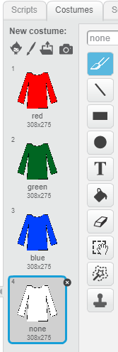

## Parts of the jumper

+ Open the starter project online at [offline starter project](https://github.com/raspberrypilearning/jazzy-jumpers-scratch2/tree/draft/en/resources/jazzy-jumpers-starter.sb2).

+ Take a look at the sprites in the project: you have five sprites in total, one for each of the four parts which make up the jumper and one for the button.

+ Click on the `Jumper` sprite and then on the Costumes tab. You will see three coloured costumes and a white "none" costume.

+ If you like, you can use the **fill** tool to change the colours of the costumes. Change the names of the costumes too so that they match the new colours.

+ However, make sure to leave the "none" costume at the bottom, and make sure it remains completely white. This costume is shown when the player is trying to remember the jumper.

+ If you want to, you can change the colours or pictures of all four sprites which make up the jumper: `Jumper`, `Stripes`, `Trim`, and `Picture`.
