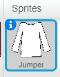
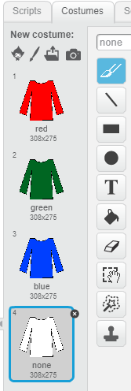

## New jumper

In this project there are a lot of sprites, and a good way of telling lots of sprites what to do is to send a **broadcast**.

[[[generic-scratch-broadcast-message]]]

Let's create a broadcast which tells the various sprites forming the jumper to each choose a random costume, so that they form a new jumper.

+ Click on the **Stage** and make sure you are on the **Scripts** tab.

The **Stage** is going to send a broadcast called `new jumper` to all of the other sprites. Think of this like a person with a megaphone giving instructions to lots of people at once.

+ Add the following code to the **Stage**. If you can't remember how to create a new broadcast message, have a look at the information in the "Broadcast a message in Scratch" section above to refresh your memory.

```blocks
when flag clicked
broadcast [new jumper v]
```

+ Click the green flag. What happens? Do you see a new jumper appear?

--- collapse ---
---
title: Answer
---
Absolutely nothing happens! This is because you haven't told the sprites making up the jumper what to do when they hear this broadcast, so they won't do anything yet. Let's tell them what to do.
--- /collapse ---

+ Click on the `Jumper` sprite in the **Sprites** panel.



+ Add this block to the scripts for the `Jumper` sprite:

```blocks
when I receive [new jumper v]
```

You can tell the `Jumper` sprite exactly what to do when it hears the broadcast by attaching the blocks you want to happen below this block.

When the `Jumper` sprite hears the broadcast, it should randomly pick one of the coloured costumes — but not the white one.



+ Attach some code to your `when I receive`{:class="blockcontrol"} block to tell the `Jumper` sprite to pick a random costume out of the first three only.

```blocks
switch costume to (pick random (1) to (3))
```

+ Click the green flag. Does the `Jumper` sprite colour change? Click the green flag a few more times to check.

The colour might not change every single time you click the green flag, because sometimes the randomly chosen costume will be the same as the previous one.

+ Now add some code to the `Stripes`, `Picture`, and `Trim` sprites so that, when they hear the broadcast `new jumper`, they also choose a random costume.

--- hints ---
--- hint ---
The code you will need to use is exactly the same for all of the sprites!

You can save time by duplicating the code. Drag all the code attached to the `when I receive`{:class="blockcontrol"} block on top of one of the other sprites in the **Sprites** panel, and let go to drop it.

Look inside that sprite, and you should see a copy of the code.
--- /hint ---
--- /hints ---

As you add more parts to the jumper, it becomes much harder for the player to memorise each one, making the game more of a challenge!
