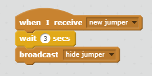

## Hide the jumper

The aim of the game is for the player to memorise the jumper, so you need to make it disappear after a few seconds.

+ Go back to the **Stage** and add some code so that, when the **Stage** receives the `new jumper` broadcast, it waits for three seconds and then broadcasts a new `hide jumper` message.

--- hints ---
--- hint ---
`When I receive new jumper`{:class="blockevents"}
`Wait for 3 seconds`{:class="blockcontrol"}
`Broadcast hide jumper`{:class="blockevents"}
--- /hint ---
--- hint ---
Here is the code you will need to add to the stage:


--- /hint ---
--- /hints ---

+ Switch to the `Jumper` sprite. Start a new block of code so that, when this sprite hears the `hide jumper` broadcast, it switches to the blank "none" costume.

```blocks
when I receive [hide jumper v]
switch costume to [none v]
```

+ Add similar code to the other sprites making up the jumper.

+ Click the green flag and test your code. Does the jumper switch to all white with a question mark picture three seconds after the green flag is clicked?


