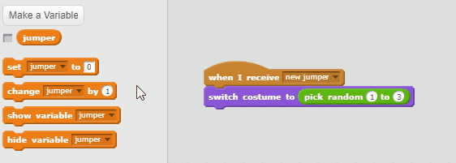
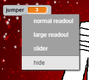

## What was on the jumper?

So far the program creates a random jumper for the player to remember, and then hides it. However, we've made a mistake! We didn't note down anywhere which costumes were randomly chosen, so how will we know if the player has recreated the jumper correctly?

To save information you will need to use later on, you can create **variables**.

+ Click on the `Jumper` sprite and create a variable called `jumper`{:class="blockdata"}.

[[[generic-scratch-add-variable]]]

You're going to save the random costume that was chosen for the `Jumper` sprite inside this variable, so that the program remembers it for later.

+ Set the value of the `jumper`{:class="blockdata"} variable as the green `pick random 1 to 3`{:class="blockoperators"} block to save the number that was chosen.

+ Then set the costume to the value of the variable `jumper`{:class="blockdata"}, which now holds a random number between 1 and 3.

+ Click the green flag and check that your `Jumper` sprite still chooses a random colour each time.

+ Create three more variables, one named after each other sprite making up the jumper.

+ Add some code to the other three sprites so that their costume number is saved in the variable named after it. Your code will be slightly different for each sprite, because each sprite will have its own variable.

+ Make sure that you hide the variables from the stage by right-clicking on them and selecting **hide**, otherwise the game will be very easy for your player!

