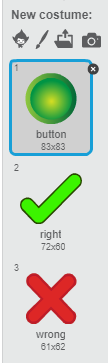

## The right jumper

When the player thinks they have recreated the jumper correctly, they should click on the button to be told whether they were right or wrong.

+ Click on the `Button` sprite and look at its costumes.



The `right` and `wrong` costumes will be used to display whether the player's jumper was the same as the one that was displayed at the start.

+ Add some code to the `Button` sprite so that, when it is clicked, it broadcasts a new message called `check`.

--- hints ---
--- hint ---
`When this sprite clicked`{:class="blockevents"}
`broadcast check`{:class="blockevents"}
--- /hint ---
--- hint ---
Here is the code you will need to add to the `Button` sprite:


--- /hint ---
--- /hints ---

When the other sprites hear the message`check`, they should each check whether the current `costume number`{:class="blocklooks"} is the same as the costume number saved in the `variable`{:class="blockdata"} named after them.

If the costume numbers do `not`{:class="blockoperators"} match, the sprites should broadcast the message `wrong`.

+ Switch to the `Jumper` sprite and add some code to check whether the player selected the correct colour. If they were wrong, broadcast `wrong`.

```blocks
when I receive [check v]
if <not <(costume #) = (jumper)>> then
broadcast [wrong v]
end
```

Note that you will need two green blocks: one for `not`{:class="blockoperators"}, and another one inside it for `=`{:class="blockoperators"}.

+ Add similar code to the other three sprites making up the jumper, but be careful to check the current costume number against the correct variable for that sprite.

+ Now switch back to the `Button` sprite.

We will assume the player is right unless we receive a broadcast saying they were wrong.

+ Add a block after you broadcast `check` to switch to the `right` costume.

```blocks
when this sprite clicked
broadcast [check v]
switch costume to [right v]
```

+ Also add blocks to switch to the `wrong` costume if the `wrong` broadcast is received.

```blocks
when I receive [wrong v]
switch costume to [wrong v]
```

If any of the sprites making up the jumper broadcasts that its costume was wrong, the player will see the X. If not, they will see the ✔.
