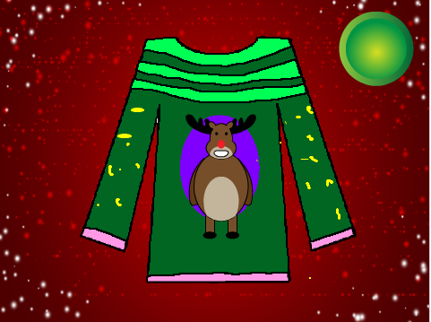

## Challenge: enhance the game

+ When the player has pressed the button and seen the result, can you show them another jumper to memorise so that they can keep playing the game over and over again?

--- hints ---
--- hint ---
The broadcast `new jumper`{:class="blockevents"} starts the process all over again. Perhaps you could wait for a few seconds after showing the result, and then broadcast this message?
--- /hint ---
--- /hints ---

+ Can you add a `winning streak`{:class="blockdata"} variable to keep track of how many correct jumpers in a row the player has remembered? If they get one wrong, the streak counter should go back to zero.

+ Add a high score variable to keep track of the longest streak.

[[[generic-scratch-high-score]]]

+ Add more costumes to each of the sprites so that there are more possible colours to remember. If you do, don't forget to update the code that chooses a random costume so that it chooses between all the available costumes including your new ones.

+ Add another sprite to represent a different part of the jumper to make the game even harder. Perhaps you could have sleeve colours, or a circle on the tummy?

